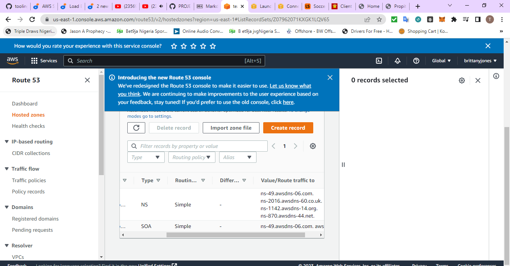
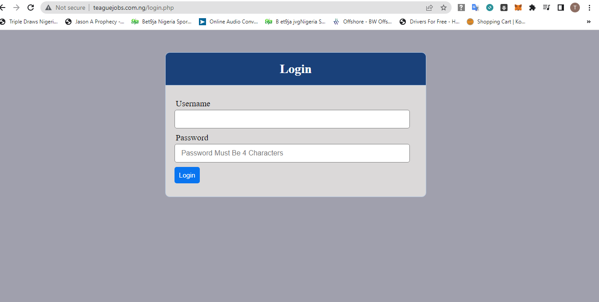
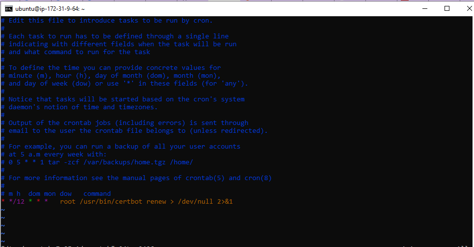

**CONFIGURE NGINX AS A LOAD BALANCER**

1. Register any domain name of your choice example [title](https://www.teaguejobs.com.ng)

2. Goto amazon console,then Route53

3. Copy the nameservers from route53 page and update on our domain management page

4. On our Route53 page create a record and update with public i.p of our nginx load balancer

5. Create another record and add www on record name with public i.p of nginx load balancer

6. Create an EC2 VM based on Ubuntu Server 20.04 LTS and name it Nginx LB (do not forget to open TCP port 80 for HTTP connections, also open TCP port 443 – this port is used for secured HTTPS connections)

7. Update /etc/hosts file for local DNS with Web Servers’ names (e.g. Web1 and Web2) and their private IP addresses

`sudo vi /etc/hosts`

8. Install and configure Nginx as a load balancer to point traffic to the resolvable DNS names of the webservers

`sudo apt update && sudo apt install nginx -y`

`sudo systemctl enable nginx && sudo systemctl start nginx`

Check NGINX status
`sudo systemctl status nginx`

- Configure Nginx LB using Web Servers’ names defined in /etc/hosts
- First we need to create a config file
`sudo vi /etc/nginx/sites-available/load_balancer.conf`

- Insert the following code into our newly created file

`upstream myproject {
    server Web1 weight=5;
    server Web2 weight=5;
  }

server {
    listen 80;
    server_name www.domain.com;
    location / {
      proxy_pass <http://myproject>;
    }
  }`

- Remove the the default NGINX config file ,so our reverse proxy will redirect to our newly config file
`sudo rm -f /etc/nginx/sites-enabled/default`
- Check if NGINX is successsfully configured
`sudo nginx -t`

- Now change directory
`cd /etc/nginx/sites-enabled/`
- We need to link our site available config file to site enable
 `sudo ln -s ../sites-available/load_balancer.conf`
 

- Reload NGINX
`sudo systemctl reload nginx`

- Now if we check our domain name it will redirect us to our website

**REGISTER A NEW DOMAIN NAME AND CONFIGURE SECURED CONNECTION USING SSL/TLS CERTIFICATES**

1. We already Registered our doamin in the previous section, now we need to make necessary configurations to make connections to our Tooling Web Solution secured!

- Install certbot and request for an SSL/TLS certificate
`sudo apt install certbot -y`

- install certbot dependencies
`sudo apt install python3-certbot-nginx -y`

- check our syntax and reload nginx
`sudo nginx -t && sudo nginx -s reload`

- Now create a certificate for our domain
`sudo certbot --nginx -d teaguejobs.com.ng -d www.teaguejobs.com.ng`

- Reload our page and check

2. Set up periodical renewal of your SSL/TLS certificate
By default, LetsEncrypt certificate is valid for 90 days, so it is recommended to renew it at least every 60 days or more frequently

- You can test renewal command in dry-run mode
`sudo certbot renew --dry-run`

- Best pracice is to have a scheduled job that to run renew command periodically. Let us configure a cronjob to run the command twice a day.
To do so, lets edit the crontab file with the following command:

`crontab -e`

- Add following line:
`* */12 * * *   root /usr/bin/certbot renew > /dev/null 2>&1`

- You can always change the interval of this cronjob if twice a day is too often by adjusting schedule expression.

**Congratulations!**

You have just implemented an Nginx Load Balancing Web Solution with secured HTTPS connection with periodically updated SSL/TLS certificates.

